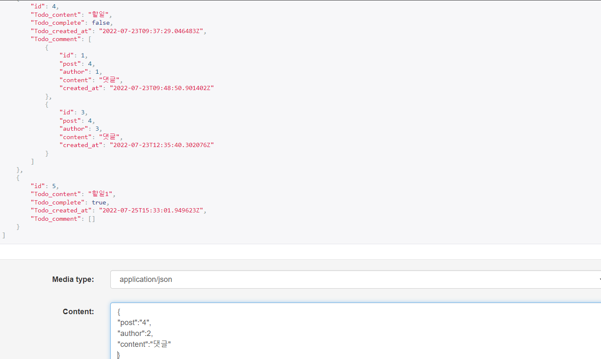
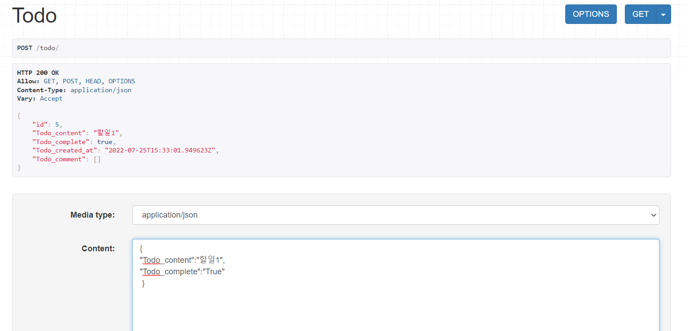
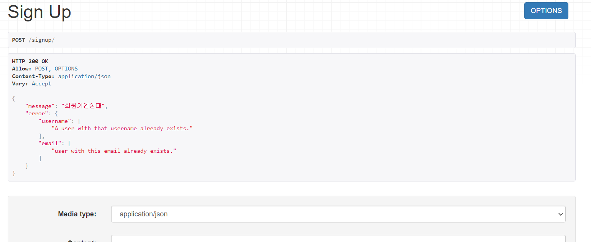

# drf_session3(User, Todo, Todocomments)

## DB 설계서
### 1. USER
+ id : int형, 고유값
+ username : char형, 유저이름
+ password : char형, 비밀번호
+ email : email형, unique, 이메일 입력
+ club : text형, 동아리 명

### 2. TODO
+ id : int형, 고유값
+ Todo_content : text형, todo 할 일 내용
+ Todo_comlete : boolean형, default값 False, 완료여부
+ Todo_created_at : datetime형, 작성시간 자동 등록

### 3. TODOCOMMENTS
+ id : int형, 고유값
+ content : text형, 댓글 내용
+ created_date : datetime형, 작성시간 자동 등록
+ author : fk, 작성자(고유값으로 구분)
+ post : fk, 작성글(고유값으로 구분)

### 4. POST
+ id : int형, 고유값
+ title : char형, 공지글 제목
+ content : text형, 공지글 본문
+ created : datetime형, 공지글 생성일자

### 5. Calendar
+ id : int형, 고유값
+ calendar_title : char형, 일정제목 및 내용
+ calendar_final : datetime형, 일정 기한
+ calendar_created : datetime형, 일정 생성일자
+ calendar_damdang : char형, 일정 담당자

----

## SERIALIZER
### 1. USERSERIALIZER
+ 회원가입 serialzer
+ fields=['id','username','email','password','club']
+ create 함수
  + email, username, club, password를 받고 회원가입

### 2. USERLOGINSERIALIZER
+ 로그인 serializer
+ email, password로 로그인
+ validate 함수
  + email과 password가 일치하는지 확인

### 3. TODOCOMMENTSERIALIZER
+ TODO(할 일 게시판) 댓글 serializer
+ fields=['id','post','author','content','created_at']

### 4. TODOSRIALZER
+ TODO(할 일 게시판) serializer
+ fields=['id','Todo_content','Todo_complete','Todo_created_at','Todo_comment']

### 5. PostSimpleSerializer
+ 공지글 전체 조회 serializer
+ fields = ('id', 'title')

### 6. PostDetailSerializer
+ 공지글 상세 조회 serializer
+ fields = ('id' ,'title' , 'content' , 'created')

### 7. PostCreateSerializer
+ 공지글 생성 serializer
+ fields = ('title', 'content','created')

### 8. CalSimpleSerializer
+ 일정 전체 조회 serializer
+ fields = ('id', 'calendar_title','calendar_final' ,'calendar_damdang')

### 9. CalDetailSerializer
+ 일정 상세 조회 serializer
+ fields = ('id' ,'calendar_title','calendar_final', 'calendar_damdang','calendar_created')

### 10. CalCreateSerializer
+ 일정 생성 serializer
+ fields = ('calendar_title','calendar_final', 'calendar_damdang', 'calendar_created')
----

## APIView
### 1. SignupView
+ post
  + 회원가입 기능
### 2. LoginView
+ post
  + 로그인 기능
### 3. TodoView
+ get
  + 할 일 리스트 전체 조회
+ post
  + 할 일 생성(업로드)
### 4. TodoDetailView
+ pk 값으로 특정 할 일 받아오기
+ get 
  + 특정 할 일 조회(+댓글)
+ delete
  + 특정 할 일 삭제
+ put 
  + 특정 할 일 수정
### 5. TodoCommentView
+ get
  + 댓글 전체 조회(+게시글)
+ post
  + 댓글 작성
  + 게시글 고유값으로 작성
### 6. TodoCommentDetailView
+ get
  + 특정 댓글 조회
  + 댓글 고유값으로 조회
+ put 
  + 특정 댓글 수정
+ delete
  + 특정 댓글 삭제
  
### 7. PostsAPIView
+ get
  + 공지글 전체 조회
+ post
  + 공지글 생성

### 8. PostAPIView
+ get
  + 공지글 상세 조회
+ put
  + 공지글 수정
+ delete
  + 공지글 삭제

### 9. CalsAPIView
+ get
  + 일정 전체 조회
+ post
  + 일정 생성
    
### 10. CalAPIView
+ get
  + 일정 상세 조회 
+ put
  + 일정 수정
+ delete
  + 일정 삭제 

----

## URL
+ 'signup/' : 회원가입
+ 'login/' : 로그인
+ 'todo/' : 전체 할 일 조회, 할 일 작성
+ 'todo/<int:pk>/' : 특정 할 일 조회, 수정, 삭제
+ 'todocomments/' : 전체 댓글 조회, 댓글 작성
+ 'todocommnets/<int:pk>/' : 특정 댓글 조회, 수정, 삭제
+ 'post/' : 공지글 전체 조회
+ 'post/<int:pk>/' : 공지글 세부 조회
+ 'cal/' : 일정 전체 조회
+ 'cal/<int:pk>/' : 일정 세부 

---

이미지 참고

+ 댓글 작성

+ 할 일 작성

+회원가입 실패

